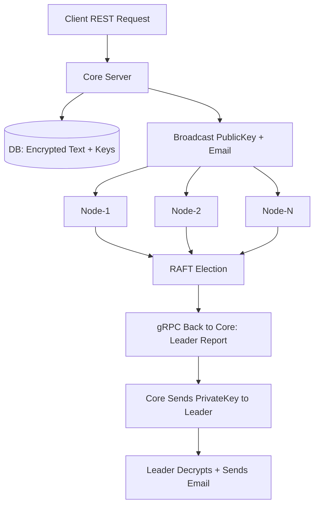

# 🚀 Raftify: Distributed Secure Messaging with RAFT Consensus & gRPC

## 📌 Project Summary

**Raftify** is a distributed system that implements **leader election**, **secure message broadcasting**, and **decentralized decryption** using the **RAFT consensus algorithm** and **gRPC**.

The system includes:
- A RESTful `Core Server` that encrypts input data using **AES-128**
- Multiple `Node` instances that coordinate using RAFT
- Secure leader selection and **decentralized decryption**
- **Email delivery** of decrypted data by the elected leader

---

## 🧠 System Scenario

1. A client calls the REST API:

    ```bash
    curl --location 'http://<CORE_IP>:8080/encrypt' \
    --header 'Content-Type: application/json' \
    --data-raw '{
      "email": "user@example.com",
      "plainText": "SensitiveMessage123"
    }'
    ```

2. The `Core`:
   - Encrypts the `plainText` using AES-128
   - Stores the **public key** in **MySQL** (table A)
   - Stores the **private key** in a separate **MySQL database** (table B)

3. The `Core` **broadcasts** the `email` and `publicKey` to all nodes using **gRPC**.

4. Each node:
   - Acknowledges readiness and exchanges votes
   - Runs RAFT to elect a leader
   - Reports the chosen leader to the Core via gRPC

5. The `Core`:
   - Waits for at least `⌈n/2⌉ + 1` confirmations **+** a leader self-confirmation
   - Sends the **private key** only to the **elected leader**

6. The **leader node**:
   - Decrypts the message using its received private key + stored public key
   - Sends a formatted email to the user via **SMTP** containing:

     ```
     Decrypted Information
     Node Name: node-1
     
     Decrypted Text: SensitiveMessage123
     
     Public Key: f410c7bb8f59a0db8d794868b0eaac81f282aae0ab20e1cd488d57bc9373fcd9
     
     Random Value: 1745635625
     
     Timestamp: 2025-07-31 16:56:15
     ```

---

## ⚙️ Architecture




## ⚙️ Tech Stack

| Component        | Technology                     |
|------------------|--------------------------------|
| **Core Server**  | Go (REST API + gRPC client/server) |
| **Node Service** | Java + Spring Boot (gRPC)      |
| **Leader Election** | RAFT Algorithm              |
| **Messaging**    | gRPC over HTTP/2               |
| **Config Format**| YAML                           |
| **Service Control** | systemd on Linux            |
| **Databases**    | MySQL (two DBs for key separation) |
| **Encryption**   | AES-128 (symmetric encryption) |
| **Email Delivery** | SMTP (configurable server)   |

---

## 📦 Setup & Deployment

> A full deployment is automated using a Bash script: `setup.sh`

### 🔧 Step-by-step:

1. **Make script executable** (if not already):
   ```bash
   chmod +x setup.sh
